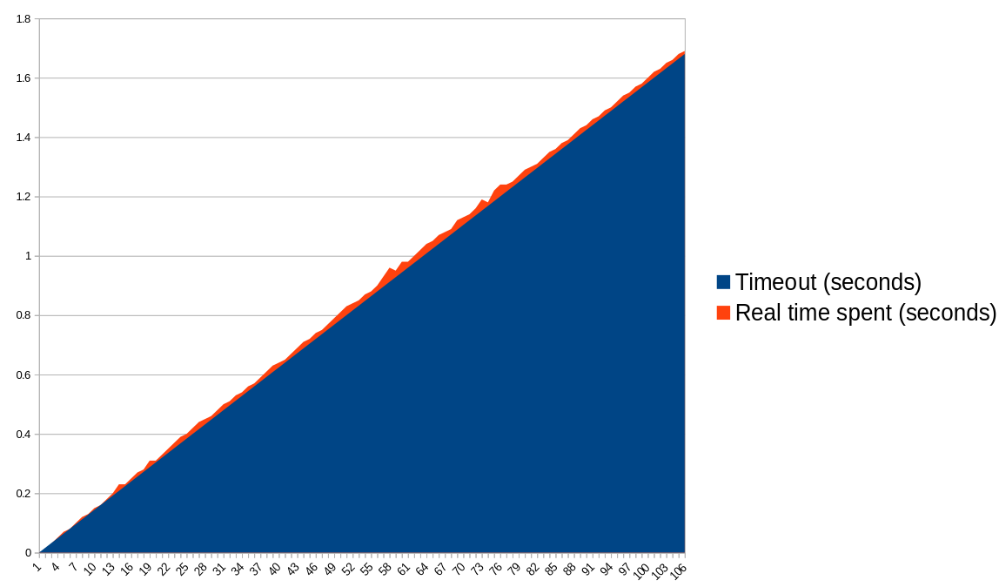

## gogitstatus

[](https://pkg.go.dev/github.com/kivattt/gogitstatus)
[](https://goreportcard.com/report/github.com/kivattt/gogitstatus)

gogitstatus is a library for finding unstaged/untracked files in local Git repositories\
Tested for Linux, FreeBSD and Windows\
This library is used in my terminal file manager [fen](https://github.com/kivattt/fen)

To try out `gogitstatus.Status()`, run the showstatus program:
```console
cd showstatus
go build
./showstatus . # In any git repository
```

To try out `gogitstatus.ParseIndex()`, run the showindex program:
```console
cd showindex
go build
./showindex ../.git/index
```

## Running tests
Run `go test -race` to run all the tests.

Run `go test -fuzz=FuzzParseGitIndexFromMemory` to fuzz for crashes in the `ParseGitIndexFromMemory()` function.

If you are developing on Linux, you can run the `./run_windows_test.sh` script to test on "Windows" with [wine](https://www.winehq.org/)

<details>
<summary>Check for context cancellation latency issues</summary>

`StatusWithContext()` is a cancellable function.

To check if we forgot a `select` block to handle cancelling somewhere, you can run this tool to graph the timeout and the actual time spent.

Ideally, both the timeout and time spent should be linear and close to eachother.
This tool generates a .csv file you can load into Excel or Libreoffice to graph the data.
```
cd showstatus
go build
./graph_timeout_delays.sh /path/to/large/repository 2> output.csv
```

### Example of a cancellation bug (spike on the right)


### Example showing good latency, no bugs

</details>

## Git Index file format resources
https://git-scm.com/docs/index-format (missing some visual separation...)\
https://github.com/git/git/blob/master/read-cache.c

## Known issues
- Only works for repos with Git Index version 2 (the one with SHA-1 hashes)
- We don't currently handle submodules (folders with .git regular files), they appear as changed no matter what
- We don't respect .gitignore from `$GIT_DIR/info/exclude` or any config stuff like `core.excludesFile`
- There are some very niche cases where our .gitignore handling, [goignore](https://github.com/botondmester/goignore) will wrongly ignore/not ignore files.
- Line ending conversion before hashing isn't handled properly. We hacked it to try both with and without conversion. This may increase risk of hash collisions (wrong output from this library).
