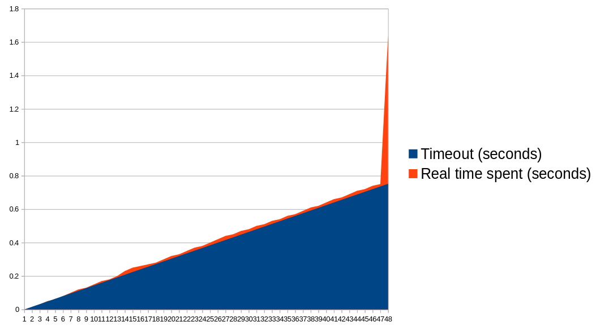
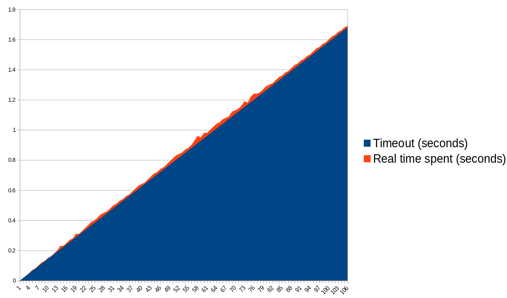

## gogitstatus

[](https://pkg.go.dev/github.com/kivattt/gogitstatus)
[](https://goreportcard.com/report/github.com/kivattt/gogitstatus)

gogitstatus is a library for finding unstaged/untracked files in local Git repositories (no staged files)\
Tested for Linux, FreeBSD and Windows\
This library is used in my terminal file manager [fen](https://github.com/kivattt/fen)

To try out `gogitstatus.Status()`, run the showstatus program:
```console
cd showstatus
go build
./showstatus . # In any git repository
```

To try out `gogitstatus.ParseIndex()`, run the showindex program:
```console
cd showindex
go build
./showindex ../.git/index
```

## Known issues
- Only works for repos with Git Index version 2 (the one with SHA-1 hashes)
- Doesn't show changes within submodules, they are skipped (this may change at some point...)
- We don't respect .gitignore from `$GIT_DIR/info/exclude` or any config stuff like `core.excludesFile`
- There are some very niche cases where our .gitignore handling, [goignore](https://github.com/botondmester/goignore) will wrongly ignore/not ignore files.
- Line ending conversion before hashing isn't handled properly. We hacked it to try both with and without conversion. This may increase risk of hash collisions (wrong output from this library).

## Performance?
This library is slower than `git status`, and uses much more CPU-time across all your CPU cores (much worse power usage).

These examples were run on a [HP ZBook Firefly G8](https://support.hp.com/us-en/product/details/hp-zbook-firefly-15.6-inch-g8-mobile-workstation-pc/2100188570) laptop running `Linux Mint 22.1 x86_64`.

Its CPU is an 11th Gen Intel i5-1135G7 (8) @ 4.200GHz

<details>
<summary>Examples</summary>

These examples were ran with files cached in memory on gogitstatus commit db17a75ea64c399870eaf635b20109a0c27b613b

## Linux
```
$ git clone --depth=1 https://github.com/torvalds/linux # commit 1f318b96cc84d7c2ab792fcc0bfd42a7ca890681
$ cd linux/

$ time git status
real    0m0,104s
user    0m0,069s
sys     0m0,162s

$ time showstatus
real    0m0,149s
user    0m0,353s
sys     0m0,253s
```

## Chromium
```
$ git clone --depth=1 https://github.com/chromium/chromium # commit 7ad861ee1f6820a4e31be33a9a6ffe0066212b25
$ cd chromium/

$ time git status
real    0m0,994s
user    0m0,693s
sys     0m1,029s

$ time showstatus
real    0m1,323s
user    0m4,651s
sys     0m1,610s
```

## This repository (gogitstatus), just for fun
```
$ git clone https://github.com/kivattt/gogitstatus # commit db17a75ea64c399870eaf635b20109a0c27b613b
$ cd gogitstatus/

$ time git status
real    0m0,002s
user    0m0,000s
sys     0m0,002s

$ time showstatus
real    0m0,003s
user    0m0,001s
sys     0m0,004s
```

Overall, it's like 1.4x slower on my computer.
</details>

## Running tests
Run `go test -race` to run all the tests.

Run `go test -fuzz=FuzzParseGitIndexFromMemory` to fuzz for crashes in the `ParseGitIndexFromMemory()` function.

If you are developing on Linux, you can run the `./run_windows_test.sh` script to test on "Windows" with [wine](https://www.winehq.org/)

<details>
<summary>Check for context cancellation latency issues</summary>

`StatusWithContext()` is a cancellable function.

To check if we forgot a `select` block to handle cancelling somewhere, you can run this tool to graph the timeout and the actual time spent.

Ideally, both the timeout and time spent should be linear and close to eachother.
This tool generates a .csv file you can load into Excel or Libreoffice to graph the data.
```
cd showstatus
go build
./graph_timeout_delays.sh /path/to/large/repository 2> output.csv
```

### Example of a cancellation bug (spike on the right)


### Example showing good latency, no bugs

</details>

## Git Index file format resources
https://git-scm.com/docs/index-format (missing some visual separation...)\
https://github.com/git/git/blob/master/read-cache.c
